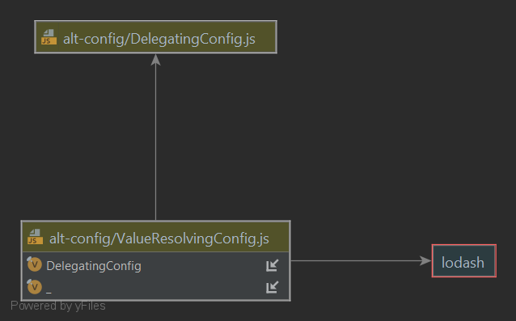
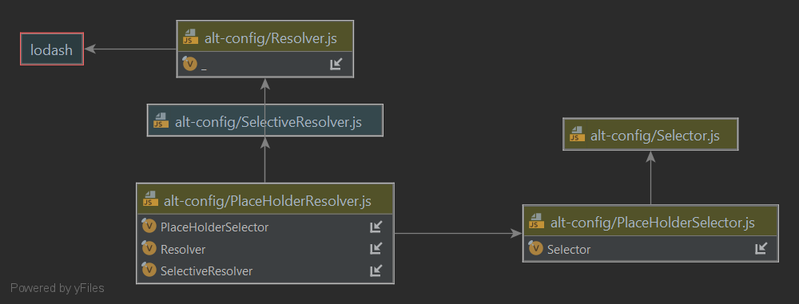
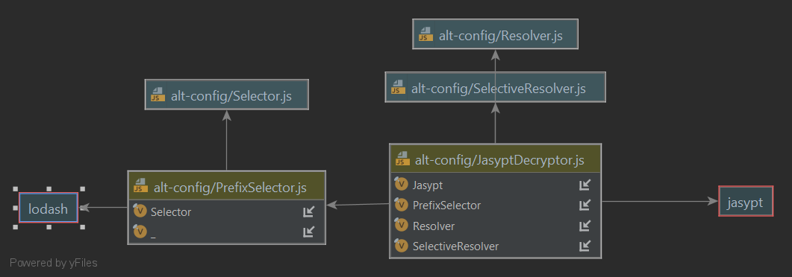

<a name="logging">Configuration</a>
================================================

This topic considers the notion of application, system or program "configuration", what it is -- _and isn't_ -- and
 explores useful features that might assist us using or deploying our code in a variety of contexts
we might find our code used in.

# Contents
1. [Definition](#definition)
1. [Configuration Or Code](#notseparate)
2. [Anything Outside The Lifecycle](#nothingoutside)
1. [As a "Service"?](#notaservice)
3. [Dynamic Configuration?](#notdynamic)
4. [Configuration Options](#options)
5. [The _Word_ on CONSTANTS](#constants)
6. [Common Configuration Modules](#constants)
   1. [dotenv](#dotenv)
   1. [config](#config)
7. [Scope All Config Values](#scope)
8. [Extending Config](#extending)
9. [Variable Expansion](#expansion)
10. [Decryption](#decrypt)
11. [Remote Config With Fetch](#fetch)
12. [ConfigFactory](#factory)

<a name="definition">Definition</a>
-----------------------------------------------

For our purpose, lets define application configuration as static or immutable contextual information that is
provided on application bootstrap, for the system to behave correctly in a given specific context 
that it is being used.

> __Definition:__ application configuration is static or immutable contextual information that is
>provided on application bootstrap.

By static or immutable, we understand that the configuration and any values or settings specified by it, 
_will not change_ after the system starts.

<a name="notseparate">Configuration Or Code</a>
-----------------------------------------------

With that definition, beyond what is provided by the language and system runtime environment, are the specific resource urls, 
hosts, ports, accounts and credentials that our code requires to run correctly in our various deployment contexts, 
such as _local, testing, integration, and production_, a separate concern to our application code?  

Said another way, should any or all of our code configuration reside somewhere else other than alongside our code? Or is 
it just _more_ code.

From experience, our position is that it is a healthy choice, to maintain as much as possible of our application 
configuration (as we have defined it) alongside our application source code, to version control it _as if it were source
code_ and bundle it along with our application packages.

Said differently, it is a good design rule to maintain as little context information as possible outside of the
application's own build and deployment lifecycle.

> __Healthy Choice:__  maintain as little context information as possible outside of the
application's own build and deployment lifecycle.

This is the position taken in the Java Spring Boot ecosystem with `application.properties` ,
and also in the .NET Core with `appsettings.json`, where these file collections are generally found (expected) in the project or classpath 
root location.  While in both ecosystems, it is not _mandatory_ to host these configuration resources in the source code
repository, it seems increasingly common to do so. These well established configuration frameworks support it, and it simplifies
our overall development experience and system complexity.

This choice has __important consequences__, because in this position _configuration is code_. Configuration changes are code changes, and will be promoted through our build, test and deployment lifecycle. 

Maintaining and deploying configuration, manually or automatically, on a lifecycle outside our application code lifecycle, 
introduces complexity and risk, and reduces the testability and flexibility of our possible deployment configurations, 
especially for local development -- where we need it most.

<a name="nothingoutside">Anything Outside The Lifecycle?</a>
------------------------------------------------

If it is a healthy choice to maintain as little context information as possible outside of the application build and
deployment lifecycle, then _what is okay_? 

From experience, it is easiest if the only application configuration  injected into our application from 
outside is the unique handle of the deployment configuration our application will be operating in, and any 
secure secrets required to access sensitive configuration values such as credentials like passwords and tokens.

It is also easier, where practicable and secure, that only a single secure passphrase be injected to 
unlock (decrypt) secret values stored alongside our code.  We will cover a simple approach later.

> __Healthy Choice:__  only a unique handle to the deployment configuration our application will be operating in,
> and a secure passphrase to access sensitive values should be injected from _outside_.

In Java, .NET and JavaScript the use of single deployment context indicators is well-supported.

* In Java and Spring Boot, the unique handle of the deployment configuration is indicated with Spring's active profiles
mechanism, either by supplying the `SPRING_PROFILES_ACTIVE` environment variable (or the `-Dspring.profiles.active` command line 
argument), with comma separated list that dictate the configuration file selection and over-loading order.  

* .NET provides a similar approach, with more "manual" file selection indicated by the developer, using the `FileConfigurationProvider`
([docs](https://docs.microsoft.com/en-us/dotnet/core/extensions/configuration-providers#file-configuration-provider))

* In Node.js,  the [config](https://www.npmjs.com/package/config) package
   supports a familiar Spring Boot-esque application configuration loading, using the __NODE_ENV__ environment 
variable convention .

Support for configuration encrypted at rest in source control is less well-supported over-all, with a lo-fi tendency
to rely on environment variables.

* Spring Boot supports decryption of values stored encrypted in source control of the form `ENC(asdasdasd)` via the Jasypt library and
the `-Djasypt.encryptor.password` argument.

* .NET relies on the use of Secrets Manager, `dotnet user-secrets` command line and associated
loading, requiring the local developer to manually add any required secrets to provide sensitive data, or
write specific configuration loading logic for the local context.

* Other platforms like JavaScript and Go seem not to provide a higher-order mechanism, other than environment variables.

    
Having set the above advice, there may be legitimate non-technical drivers that might preclude maintaining some
configuration values in the code lifecycle.   A system requiring regulatory approvals with digital hashing of the code base, 
where the approval cycle is slower than the volatility of the system configuration (for example, credentials might need
to be refreshed on a schedule faster than the regulator can support or allow), could be such an example.  There would
be endless others.

In general, if necessary,  its a healthy choice, to minimise non-source controlled configuration as much as possible, and _dereference_ 
those we cannot with a consistent mechanism if possible. 

> __Healthy Choice:__  if necessary, for non-technical reasons, minimise non-source controlled configuration as much as possible, and _dereference_
> those we cannot with a consistent mechanism if possible.


<a name="notaservice">As A Service?</a>
------------------------------------------

It is not an uncommon pattern to provide configuration as a service, hosted remotely and ingested over the network. [Spring Cloud Config](https://spring.io/projects/spring-cloud-config) is  
 such an example.

With respect to our __healthy choice__ that its good to maintain our application configuration 
 alongside our application source code, then it follows that having a build lifecycle for our
configuration in another application service is undesirable. 

It’s generally a healthy choice to __not__ manage your application 
configuration in a separate external (possibly shared) service, as it increases the accidental complexity of the deployment
architecture, making it difficult to configure different and ephemeral deployment options, 
including _local development and testing_.

> __Healthy Choice:__  _do not_ manage our application configuration as a separate external service. Because 
> _accidental complexity_.

Having set the above advice, again where there may be legitimate non-technical drivers that  preclude maintaining some
configuration values in the code lifecycle, then minimise remote configuration values as much as possible, and _dereference_
those we ingest from the remote service with a consistent mechanism if possible.

> __Healthy Choice:__  if necessary, for non-technical reasons, minimise remote configuration values as much as possible, and _dereference_
those we ingest from any remote service with a consistent mechanism if possible.

<a name="notdynamic">Dynamic Configuration?</a>
------------------------------------------------------------------

From our definition, we said application configuration is static or immutable contextual information that is provided on
application bootstrap. So it follows that updating system parameters after bootstrap is _no longer the concern of our 
application configuration design_. Said differently, configuration is by definition &ndash; _not dynamic_. So it follows 
that it's a healthy choice to separate initial bootstrap configuration from any runtime updates to dynamic application 
switches and routing.

> __Healthy Choice:__  separate initial bootstrap configuration from runtime updates to dynamic application service 
> switches or routing.

More generally speaking, it is also a good pattern to fetch and set initial application parameter values only one-time on startup
from the application configuration, rather than in-line fetching from the config each time they are used. 

> __Healthy Choice:__  fetch and set initial application parameter values from the application configuration, 
> rather than inline fetching from the config each and every time.

Note, a fetch and set pattern (as described above) does not stop us achieving those 
dynamic updates, it is just _not the concern of our application configuration design_.  

Polling Launch Darkly, or some other configuration service, or exposing an API interface to tweak a system parameter are user stories with complex 
application integration patterns, all of which increase the entropy of our application architecture, and the 
complexity of our operating processes.

They sure are cool and super-interesting concerns, but we'll park them for later.

<a name="options">Configuration Options</a>
-----------------------------------------------

Languages offers various options for injecting application configuration from “outside”.  Server side
langauges have three fundamental ways it exposes immediate “system” context information passed into the runtime interpreter: 

- command-line arguments,
- environment variables, and 
- I/O operations.

JavaScript in the browser is unique in this respect and provides the window and window.navigator objects, with 
relevant (though not standard) system information.  

Let's address server languages here, and defer the browser for later.

### Command-Line Arguments

The node runtime provides the process object, which exposes the `process.argv` array with the command-line parameters 
provided, including the executable, the target script and then trailing parameters as so.

```shell
// contents of argv.js script console.log(process.argv);
$ node argv.js one two three four five
[ 'node', '/usr/src/argvdemo/argv.js', 'one', 'two', 'three', 'four', 'five' ]
```

The process object also exposes the `process.execArgv` array with the Node.js specific command-line parameters provided,
such as –version and the `process.execPath` with the absolute pathname of the executable that started the Node.js process.

Outside of a dedicated command line interface (cli), it’s a good design rule to mostly avoid injecting 
command line arguments as application configuration.

> __Good Design Rule:__  mostly, avoid injecting command line arguments as application configuration.

### Environment Variables

The node runtime process object also exposes the `process.env` object with the “visible” system environment variables, 
such as `USER`, `PATH`, `HOME` and so on. It is also possible to set an environment variable directly on the node 
command line with the –e switch.

```shell
$ node –e ‘process.env.foo = “bar”’ myapp/index.js
```

With a few notable exceptions, that we will cover soon, it’s a good design rule to mostly avoid injecting custom 
environment variables as application configuration.

> __Good Design Rule:__  mostly, avoid injecting environment variables as application configuration.


Because env vars touch on this very important, and common problem, topic I’ll cover now it now: it’s a good 
_organisational_ design rule to combine operations with development – it is the very definition of devops, more essential
and than merely adopting “infrastructure as code”.  It's what I might mean if I ever used the phrase “full-stack”, which 
is a non-sense term for too many reasons to cover here.

> __Good Design Rule:__  combining operations with development, in a _true_ devops organisational model delivers
> more flexible and scalable applications, more efficiently and more effectively.

Broadly speaking, if your operational environment’s security context is insistent on a “separation of authority” between
operations and development, it is likely to limit your local deployment flexibility, but even so, good application design 
can mitigate this, which I will demonstrate eventually.

### Input / Output

Since, as a rule, it’s good design practice to minimise the use of command line arguments and environment variables, 
we are left with the Node.js I/O facilities to load application configuration from the file system or network interfaces.


Since for the purpose of this module, we have constrained our definition of application configuration to _static or 
immutable_ contextual information provided on application bootstrap, and the _network_ is rarely either of those, it 
follows that is is a good design to get application configuration from the file system (ideally your 
application bundle)

> __Good Design Rule:__  inject configuration from read-only files bundled with your application.

<a name="constants">The _Word_ on CONSTANTS</a>
---------------------------------------------

Now, before we get into the weeds with modules, lets just have _the word_ on `CONSTANTS`. Configuration and constants 
are also separate concerns, since configuration is by definition NOT CONSTANT.  

But it's not uncommon to see this kind of code.

```javascript
const constants = {};
constants.ENV = process.env.NODE_ENV; // is a smell, say no more
```

Noting that JavaScript doesn't cater well for object constants and we adopt `UPPER_SNAKE_CASE` as a well understood 
convention to indicate constancy instead, then apart from the obvious, that the `ENV` property is not in fact a `const`,
the `process.env.NODE_ENV` is by definition, essentially a variable, constant only in the lifetime or scope of an
application's deployment context.

> __Good Design Rule:__  separate CONSTANTS from configuration.


The `constants` const is also _global_ to the scope of the module, and worse, often exported as such. Global constants
are a smell, and constants should be grouped, enumerated and exposed via a meaningful module:

```javascript
const {FINE_STRUCTURE} = require ('FundamentalConstants'); 
const {c,G} = require ('PhysicalConstants');
```
> __Good Design Rule:__  constants should be grouped, enumerated and exposed via a meaningful module.

<a name="jscondig">Common Configuration Modules</a>
-------------------------------------

### <a name="dotenv">dotenv</a>

The JavaScript open-source community provides the popular [dotenv](https://www.npmjs.com/package/dotenv) package for 
locally managing application configuration provided as environment variables. On the basis that the only application configuration that 
should be injected into your application from outside should be the unique handle of the deployment (via NODE_ENV) , 
it follows that it is also a good design rule to aver the need for and use of dotenv and related `.env` files.

We're not saying dotenv isn't great, it is &ndash; just that avoiding environment variables negates the need for it.

> __Good Design Rule:__  aver thus use of dotenv, if you can avoid the use of env vars.


By design, dotenv files are also not intended to be source controlled (via .gitignore), requiring the developer to 
manually intervene to get things running in local-development, which is bad.

> __Good Design Rule:__  avoid any manual set up or intervention especially in local-development.

### <a name="config">config</a>

The JavaScript open-source community also provides the excellent [config](https://www.npmjs.com/package/config) package 
for managing application configuration. As with the [logging](./LOGGING.md) material, it is a good design rule to 
abstract all our configuration behind a common façade, which has the benefit of standardising how it is achieved and 
encapsulating common good design features.

> __Good Design Rule:__ abstract all config loading behind a common façade.

It is a good design rule to use the [config](https://www.npmjs.com/package/config)  package façade to isolate all 
configuration, and aver the use of `.env` files in favour of a `config/local-development.json` file. It is also good 
design rule to use JSON as the format, rather than .js or .yml (yes, yaml). Executable configuration and deferred 
evaluation at bootstrap are just bad in principle, and we don’t need yet another lazy markup syntax, 
especially one that uses whitespace as a scope discriminator.

> __Good Design Rule:__ prefer a [config](https://www.npmjs.com/package/config) module `config/local-development.json`, in 
> JSON over a [dotenv](https://www.npmjs.com/package/dotenv) module `.env` file.

The `config` package is great out of the box, and we could just stop here, but there is a couple of features it lacks, 
which we will design and extend.  

### <a name="scope">Scope All Config Values</a>

The node config package supports a hierarchical (dot separated) format for configuration values, and tt is a good design
rule to always scope your configuration values to avoid naming collisions and conflicts, when applying modular application architectures.

> __Good Design Rule:__ scope your configuration values to avoid naming collisions and conflicts.

The @alt-javascript/logger scopes all it’s configuration under the “logging” configuration path, and is a good example of
how this rule is applied.

```json
{
"logging" :
"format" : "
"^^^ set a format to json for JSON output" : doco
" level":
"/" : "
"@alt javascript /config crypto challenge" : "
"^^^ set a path level to enable log lines at that folder, down to file/module" : doco
"test" :
"fixtures" :
"quiet" :
"^^^ set quiet to false to see logs in unit tests" : doco
```

It is sensible to put all your config under the npm package name of your module, even though I break this rule above,
because in the real world people would be like _wtf_ if I had used `@alt-javascript/logger.levels` instead.

> __Good Design Rule:__ scope your configuration values under the npm package name of your module.

<a name="extending">Extending Config</a>
----------------------------------------

The designers of the usual config package have made it immutable by design, which is a sensible choice, but it does
limit the flexibility of what we can achieve with it.

To extend the behaviour of config is actually very easy, because it has a radically simple interface, with just two
functions `get(path)` and `has(path)`. So easy, we added a defaultValue to the get to avoid having to `has()` check it.

All we need to do is implement familiar delegator pattern, like we used for the `ConfigurableLogger` design in the Logging
module, and intercept the behaviours.

We do with the `DelegatingConfig` and its extension class `ValueResolvingConfig`



<a name="expansion">Variable Expansion</a>
----------------------------------------
A common utility feature of configuration libraries is variable expansion, that allows some modularity and re use across
configuration keys, but config doesn’t seem to support it.

```json
{
   "key": "value",
   "one" : "one",
   "placeholder": "start.${one}.${nested.two}.end",
   "nested" : {
      "key" : "value",
      "two" : "two",
      "placeholder": "start.${one}.${nested.two}.end",
   }
}
```
We achieve this by injecting the ValueResolvingConfig , with a Resolver, which will take the value return by the
delegate, and as a key (or input) into a deterministic process to resolve, transform or mutate to underlying value into a
new one. From the perspective of the user, the config object remains immutable, because the value can never be
changed.

Here is the PlaceHolderResolver



<a name="decrypt">Decryption</a>
--------------------------------

Another common utility feature of configuration libraries is decrypting config values encrypted with a passphrase
maintained outside of the source repository, effectively obfuscating your secret values as below.

```json
{
  "placeholderEncrypted": "start.${nested.encrypted}.end",
  "nested" : {
     "encrypted" : "enc.pxQ6z9s/LRpGB+4ddJ8bsq8RqELmhVU2"
  }
}
```

It’s a good design rule, in controlled development zones, to use encrypted properties as an effective strategy to have
your secret keys maintained as source code , and not injected or maintained on a separate deployment lifecycle,
increasing your deployment complexity.

> __Good Design Rule:__ use encrypted properties as an effective strategy to have your secret keys  maintained 
> as source code.


If you doubt the efficacy of this simple technique, take the (https://github.com/craigparra/alt-config-crypto-challenge)

Here is the `JasyptDecryptor`, which decrypts values encrypted with the jasypt package, taking the passphrase from the
NODE_CONFIG_PASSPHRASE environment variable.



<a name="fetch">Remote Config With Fetch</a>
-----------------------------------
It’s easy to imagine a resolver that uses the fetch api,  but based on our earlier
words on configuration as a service we don’t encourage it.

That said, we still implemented it for raw utility and config values that start with the prefix `url.` can be 
fetched and resolved asynchronously with the `fetch` function, and HTTP options can be specified as in the example 
config file.  To avoid bundling `node-fetch`.

You need to provide it by using `@alt-javascript/boot` to boot it into the global root context, where the package 
will detect it.

```javascript
const {boot} = require('@alt-javascript/boot');
const {config} = require('@alt-javascript/config');
const fetch = require('node-fetch');

boot({config,fetch})
const webdata = await config.fetch('pathToUrlPrefixedValue'); 
```

`local-development.json`
```json
{
  "jsonplaceholder": {
    "todos": "url.https://jsonplaceholder.typicode.com/todos/1"
  },
  "fetchWithOpts" : {
    "url": "url.https://jsonplaceholder.typicode.com/todos/1",
    "authorization": "Basic dXNlcjpwYXNz",
    "method": "get",
    "body": {},
    "headers": {"Content-Type": "application/json"}
  }
}
```


<a name="factory">ConfigFactory</a>
-----------------------------------

In practice, we really want the ValueResolvingConfig to do all functions, so we chain an array of resolvers in a 
a `DelegatingResolver`.

```javascript
const Resolver = require('./Resolver');

module.exports = class DelegatingResolver extends Resolver {
  constructor(resolvers) {
    super();
    this.resolvers = resolvers;
  }

  resolve(config) {
    let resolvedConfig = config;
    for (let i = 0; i < this.resolvers.length; i++) {
      resolvedConfig = this.resolvers[i].resolve(resolvedConfig);
    }
    return resolvedConfig;
  }
};
```

To put it all together we, we create a ConfigFactory to build and inject the complex arrangement of classes, and 
export it as the regular config package does.

```javascript
const npmconfig = require('config');
const ValueResolvingConfig = require('./ValueResolvingConfig');
const DelegatingResolver = require('./DelegatingResolver');
const PlaceHolderResolver = require('./PlaceHolderResolver');
const PlaceHolderSelector = require('./PlaceHolderSelector');
const JasyptDecryptor = require('./JasyptDecryptor');
const PrefixSelector = require('./PrefixSelector');
const URLResolver = require('./URLResolver');

module.exports = class ConfigFactory {

  static detectFetch(fetchArg) {
    //...
  }

  static getConfig(config, resolver, fetchArg) {
    const placeHolderResolver = new PlaceHolderResolver(new PlaceHolderSelector());
    const jasyptDecryptor = new JasyptDecryptor(new PrefixSelector('enc.'));
    const urlResolver = new URLResolver(new PrefixSelector('url.'), ConfigFactory.detectFetch(fetchArg));
    const delegatingResolver = new DelegatingResolver(
      [placeHolderResolver, jasyptDecryptor, urlResolver],
    );
    const valueResolvingConfig = new ValueResolvingConfig(config || npmconfig,
      resolver || delegatingResolver);

    placeHolderResolver.reference = valueResolvingConfig;
    return valueResolvingConfig;
  }
};

```
From a user perspective, we get a valuable uplift in features, with latterly no change to our downstream 
application code.
