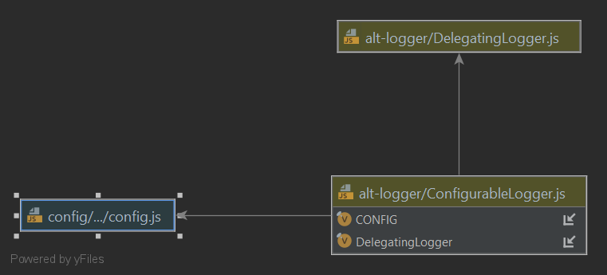
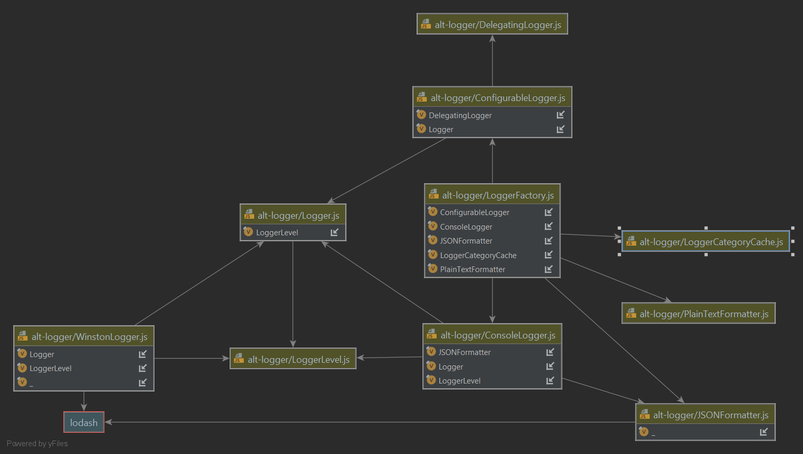

<a name="logging">Logging Design Trail</a>
=============================

<a name="why">Why Start With Logging?</a>
-------------------------------------------
When writing application code, it’s a useful if our application code is observable.

> __Good Design Rule:__  application code should be observable.

Observability is a very natural thing for code developers, and in fact usually the very first thing we do.

```javascript
// We’ve all done this.
console.log('Hello world!');
```

We use logging to observe the behaviour of our code, quickly and easily, and as a fallback in lieu of more advanced 
tooling that may not be present in an applications deployment context, such as debuggers or profilers. But, 
observability has a natural trade-off &ndash; I/O is expensive.  It is a fundamental obligation that application 
logging is performant.

> __Good Design Rule:__  application logging must be performant.

Writing every other line to disk, and spamming output streams with megabytes of data no man or machine could reasonably 
consume is bad. But, _some_ people do it.

>For the purpose of this material, we are restricting our definition of “logging” to log lines written by the developer 
to observe the behaviour of the system at runtime.  That is important, because it restricts our design. 
Transaction and audit logs (like, for example, http access logs), do not meet this definition of “logging” in the strict sense, 
and are more rightly though of as an application feature we might implement to meet a business requirement, 
like legal compliance.
>
> They might just happen to use a logging façade, in exactly the same way as info logging – but we are not 
considering these patterns here.

<a name="why">JavaScript Logging</a>
------------------------------------

JavaScript offers various options for logging, and the [@alt-javascript/logger](https://www.npmjs.com/package/@alt-javascript/logger) package in the 
[alt-logger](https://github.com/craigparra/alt-logger#readme) repository 
explores these. At it’s most basic design expression, logging can just be achieved with just the 
`console.log` function:

```javascript
// I mean, just don't
console.log('a debug message');
```

It’s helpful when your developing, but it’s prudent to remove console.log statements from production code. 

> __Good Design Rule:__ remove console.log statements from production ready code.

It's such an important rule, that the no-console eslint rule will pleasantly warn you, like a friendly boss.

```shell
C:\usr\src\alt-package-conventions\Colour.js
  4:5  warning  Unexpected console statement  no-console
✖ 1 problem (0 errors, 1 warning)
```

To solve this, it's useful to abstract all our logging statements behind a common façade, or 
wrapping module, which has the benefit of isolating that pesky eslint no-console rule to just one-line of code.

> __Good Design Rule:__ abstract all logging statements behind a common façade.

<a name="consolelogger">A Simple Console Logger</a>
---------------------------------------------------

Now, we're definitely _not in the business of writing loggers_, and there are great packages in the community like 
[winston](https://www.npmjs.com/package/winston) that pretty much abstract logging for us already, but the 
[Logger](https://github.com/craigparra/alt-logger/blob/master/Logger.js) class is a succinct example of a 
simple logger facade that demonstrates some useful logging utility that might otherwise be overlooked in the weeds of
winston, and also opens up our options, as we will see.

```javascript
const LoggerLevel = require('./LoggerLevel');

module.exports = class Logger {
  constructor(category, level, levels) {
    this.category = category || 'ROOT';
    this.levels = levels || LoggerLevel.ENUMS;
    this.level = this.levels[level || LoggerLevel.INFO];
  }

  setLevel(level) {
    this.level = this.levels[level || LoggerLevel.INFO];
  }

  isLevelEnabled(level) {
    return this.levels[level] <= this.level;
  }

  isFatalEnabled() {
    return this.isLevelEnabled(LoggerLevel.FATAL);
  }

  isErrorEnabled() {
    return this.isLevelEnabled(LoggerLevel.ERROR);
  }

  isWarnEnabled() {
    return this.isLevelEnabled(LoggerLevel.WARN);
  }

  isInfoEnabled() {
    return this.isLevelEnabled(LoggerLevel.INFO);
  }

  isDebugEnabled() {
    return this.isLevelEnabled(LoggerLevel.DEBUG);
  }

  isVerboseEnabled() {
    return this.isLevelEnabled(LoggerLevel.VERBOSE);
  }
};
```

The Logger class accepts a category, a severity level and optionally custom levels.  From a design perspective, this allows 
our application logging to be specific and granular in 2-dimensions &ndash; _severity and context_.

> __Good Design Rule:__ application logging should be granular, with specific _severity and context_.

With the provided level set on the logger, the class can now discriminate whether a statement should be logged based on the 
intended severity for that specific logger instance, with the familiar `info`, `debug` and `error` like functions that
[winston](https://www.npmjs.com/package/winston) and such support.

```javascript
  logger.debug(`Show me this ${value} if level is equal or greather than debug`);
```

The `Logger` doesn't actually implement the `debug` or other functions yet, because it is an ostensibly "abstract" class
with no output transport, combined with the way JavaScript prototype inheritance works.  

What `Logger'` does provide though, is an interface to pre-test if a severity level is "enabled", before performing an 
expensive operation to output.   Because logging is entirely for the developer or operator, and not an application 
feature as such, and it's I/O may have an impact on performance, simply invoking the usual 
`logger.debug('Show me the result of a ${costlyFunction()}')` would be too late in this example statement, because the 
expression is _always_ calculated before the severity is checked.

```javascript
if (logger.isDebugEnabled()){
    logger.debug('Show me the result of a ${costlyFunction()}');
}
```

The `Logger` class is extended by the [ConsoleLogger](https://github.com/craigparra/alt-logger/blob/master/ConsoleLogger.js)
class, as shown.


First and foremost, `ConsoleLogger`, implements the output transport with `console.log()` exempted from the usual
eslint `no-console` rule in this case, and adds in the familiar `info`, `debug` and `error` like functions that we 
expect to see.

```javascript
  log(level, message, meta) {
    if (this.levels[level] <= this.level) {
        // eslint-disable-next-line no-console
        console.log(this.formatter.format((new Date()), this.category, level, message, meta));
    }
    
    debug(message, meta) {
        this.log(LoggerLevel.DEBUG, message, meta);
    }
}
```

It also accepts an output formatter and default metadata that will be added to the log lines.  
Take note of how the prototype inheritance works (it explains why `Logger` doesn't implement what would be
redundant functions).

```javascript
  
const Logger = require('./Logger');
const LoggerLevel = require('./LoggerLevel');
const JSONFormatter = require('./JSONFormatter');

module.exports = class ConsoleLogger extends Logger {
  constructor(category, formatter, level, meta, levels) {
    super(category, level, levels);
    this.formatter = formatter || new JSONFormatter();
    this.meta = meta || {};

    ConsoleLogger.prototype.setLevel = Logger.prototype.setLevel;
    ConsoleLogger.prototype.isLevelEnabled = Logger.prototype.isLevelEnabled;
    ConsoleLogger.prototype.isDebugEnabled = Logger.prototype.isDebugEnabled;
    ConsoleLogger.prototype.isVerboseEnabled = Logger.prototype.isVerboseEnabled;
    ConsoleLogger.prototype.isInfoEnabled = Logger.prototype.isInfoEnabled;
    ConsoleLogger.prototype.isWarnEnabled = Logger.prototype.isWarnEnabled;
    ConsoleLogger.prototype.isErrorEnabled = Logger.prototype.isErrorEnabled;
    ConsoleLogger.prototype.isFatalEnabled = Logger.prototype.isFatalEnabled;
  }

  log(level, message, meta) {
    if (this.levels[level] <= this.level) {
      // eslint-disable-next-line no-console
      console.log(this.formatter.format((new Date()), this.category, level, message, meta));
    }
  }

  debug(message, meta) {
    this.log(LoggerLevel.DEBUG, message, meta);
  }

  verbose(message, meta) {
    this.log(LoggerLevel.VERBOSE, message, meta);
  }

  info(message, meta) {
    this.log(LoggerLevel.INFO, message, meta);
  }

  warn(message, meta) {
    this.log(LoggerLevel.WARN, message, meta);
  }

  error(message, meta) {
    this.log(LoggerLevel.ERROR, message, meta);
  }

  fatal(message, meta) {
    this.log(LoggerLevel.FATAL, message, meta);
  }
};
```

At this point, we have a fairly high functioning console logging abstraction with only five classes in play: `Logger`,
`LoggerLevel`,`ConsoleLogger`,`JSONFormatter` and `PlanTextFormatter`.  We can abstract away our logging, and set a 
specific severity level on any individual logger instance as so:

```javascript
const {ConsoleLogger,JSONFormatter} = require('@alt-javascript/logger');
const logger = new ConsoleLogger(`@myscope/mypackage/MyClass`,new JSONFormatter(),LoggerLevel.INFO);
logger.info('Hello world!');
```

And you will get:

```JSON
{"level":"info","message":"Hello World!","timestamp":"2021-07-15T02:09:56.062Z","category":"@myscope/mypackage/MyClass"}
```

It is a good choice to output log lines as JSON in production, as it is easily consumed by log aggregation tools like 
[Logstash](https://www.elastic.co/logstash/), and okay for humans as well.   Plain text should be reserved for local 
development only, perhaps if you are JSON dyslexic.

> __Good Design Rule:__ application log lines should be output formatted as JSON in production.

You will note that the parameters in the line `new ConsoleLogger(`@myscope/mypackage/MyClass`,new JSONFormatter(),LoggerLevel.INFO);` 
are clumsy, and that's because the ConsoleLogger doesn't quite meet the second part of our design expectation, that logging
should be specific by severity and by _context_.  We provide a contextual category, and we write it to the log line, but
it isn't actually used to determine if a log line should be output.  Ideally, we should determine the severity level by
the context category that the logger is defined with, which we do with the `ConfigurableLogger`.

<a name="configlogger">ConfigurableLogger</a>
-------------------------------------------

The [ConfigurableLogger](https://github.com/craigparra/alt-logger/blob/master/ConfigurableLogger.js)
class, as shown, leverages the popular [config](https://www.npmjs.com/package/config) package to define and set 
 `LoggerLevel` values for a given Logger `category` as application configuration.  Application configuration is static or 
immutable contextual information that is provided to our application at bootstrap.  The contextual information
in this case is the log levels required for each logger category for the specific deployment configuration 
the application is running in, say local to the developer versus in production.

It should be obvious that log levels for your categories will be different locally when debugging, than in production 
where for better performance levels should be set to `LoggerLevel.Error`.

> __Good Design Rule:__ application log levels should be set to ERROR and above in production.


Let's take a look at the design of `ConfigurableLogger`.  First, rather than extending the behaviour of the `ConsoleLogger`
as we did with `Logger`, instead we aggregate and delegate behaviour to `ConsoleLogger` as one of many possible providers,
by extending a new `DelegatingLogger` class.



The `DelegatingLogger` accepts a logging `provider`, to which it  hands off all the functions.  We pass
a ConsoleLogger, or other implementation  into the constructor to do the actual work of logging lines.  We 
provide a [WinstonLogger](https://github.com/craigparra/alt-logger/blob/master/WinstonLogger.js),
[MultiLogger](https://github.com/craigparra/alt-logger/blob/master/MultiLogger.js) and
[EphemeralLogger](https://github.com/craigparra/alt-logger/blob/master/EphemeralLogger.js) as examples.

This allows the `ConfigurableLogger` to apply the category log level configuration, to any of these working facade
classes.  Along with the provider, the class accepts a config instance, a category and a configPath (we'll ignore
the `registry` for now).

```javascript
const DelegatingLogger = require('./DelegatingLogger');

module.exports = class ConfigurableLogger extends DelegatingLogger {
  constructor(config, provider, category, configPath, registry) {
    super(provider);
    this.config = config;
    this.category = category;
    this.configPath = configPath;
    this.registry = registry;
    this.provider.setLevel(
      ConfigurableLogger.getLoggerLevel(
        this.category,
        this.configPath,
        this.config,
        this.registry,
      ),
    );

    ConfigurableLogger.prototype.setLevel = DelegatingLogger.prototype.setLevel;
    ConfigurableLogger.prototype.log = DelegatingLogger.prototype.log;
    ConfigurableLogger.prototype.debug = DelegatingLogger.prototype.debug;
    ConfigurableLogger.prototype.verbose = DelegatingLogger.prototype.verbose;
    ConfigurableLogger.prototype.info = DelegatingLogger.prototype.info;
    ConfigurableLogger.prototype.warn = DelegatingLogger.prototype.warn;
    ConfigurableLogger.prototype.error = DelegatingLogger.prototype.error;
    ConfigurableLogger.prototype.fatal = DelegatingLogger.prototype.fatal;

    ConfigurableLogger.prototype.isLevelEnabled = DelegatingLogger.prototype.isLevelEnabled;
    ConfigurableLogger.prototype.isDebugEnabled = DelegatingLogger.prototype.isDebugEnabled;
    ConfigurableLogger.prototype.isVerboseEnabled = DelegatingLogger.prototype.isVerboseEnabled;
    ConfigurableLogger.prototype.isInfoEnabled = DelegatingLogger.prototype.isInfoEnabled;
    ConfigurableLogger.prototype.isWarnEnabled = DelegatingLogger.prototype.isWarnEnabled;
    ConfigurableLogger.prototype.isErrorEnabled = DelegatingLogger.prototype.isErrorEnabled;
    ConfigurableLogger.prototype.isFatalEnabled = DelegatingLogger.prototype.isFatalEnabled;
  }

  static getLoggerLevel(category, configPath, config, registry) {
    let level = 'info';
    const path = configPath || 'logging.level';
    const categories = (category || '').split('/');
    let pathStep = path;

    const root = `${pathStep}./`;
    if (registry.get(root)) {
      level = registry.get(root);
    } else if (config.has(root)) {
      level = config.get(root);
      registry.add(root, level);
    }

    for (let i = 0; i < categories.length; i++) {
      pathStep = `${pathStep}${i === 0 ? '.' : '/'}${categories[i]}`;
      if (registry.get(pathStep)) {
        level = registry[pathStep];
      } else if (config.has(pathStep)) {
        level = config.get(pathStep);
        registry.add(pathStep, level);
      }
    }
    return level;
  }
};
```

This is then used to read the `LoggerLevel` for the instance category from the config file.  The categories act as '/'
separated hierarchy, with the deeper (more specific) paths taking precendence.  There is a root '/' config path for
all categories.  The `logging.level` config path is used as the entry point by default, but can be changed with the 
`configPath` constructor argument.

>Watch out for period '.' characters in your categories, as they have semantic meaning in the config package 

`local-development.json`
```json
{
 "logging" : {
  "level" : {
   "/" : "info",
   "@myorg/mypackage/" : "verbose",
   "@myorg/mypackage/MyModule" : "debug"
  }
 }
}
```

Though just arbitrary strings, it's a good idea to use your class or module requires path as the category, so you
can adjust the logging per class or file that is of working interest.

> __Good Design Rule:__  log categories should match your module require path.

At this point, we can now instantiate a logger like so, which again is a little bit clumsy.

```javascript
const {config} = require('config');
const {ConfigurableLogger, ConsoleLogger} = require('@alt-javascript/logger');
const logger = new ConfigurableLogger(config,new ConsoleLogger(),'@myorg/mypackage/MyModule');

logger.info('Hello world!');
```
Enter the `LoggerFactory`.

<a name="loggerfactory">LoggerFactory</a>
-------------------------------------------

The [LoggerFactory](https://github.com/craigparra/alt-logger/blob/master/LoggerFactory.js) is a static convenience class
to streamline the syntax for creating a logger instance as needed, with a more succinct syntax.  This is good
option in lieu of a more sophisticated way to do this, like dependency injection.


> __Good Design Rule:__  factory classes are a simpe way to streamline creating instances with complex constructor inputs.


```javascript
const ConfigurableLogger = require('./ConfigurableLogger');
const ConsoleLogger = require('./ConsoleLogger');
const LoggerRegistry = require('./LoggerRegistry');

module.exports = class LoggerFactory {
    static loggerRegistry = new LoggerRegistry();

    static getLogger(config, category, provider, configPath, registry) {
      return new ConfigurableLogger(config,
        provider || new ConsoleLogger(category),
        category,
        configPath,
        registry || LoggerFactory.loggerRegistry,
      );
    }
};
```

Our code now becomes:

```javascript
const {config} = require('config');
const {LoggerFactory} = require('@alt-javascript/logger');
const logger = LoggerFactory.getLogger(config,'@myorg/mypackage/MyModule');

logger.info('Hello world!');
```

<a name="loggerfactory">LoggerRegistry</a>
-------------------------------------------

Application configuration is a great way to bootstrap our application with log levels suitable to the
deployment context it will be running in, but it immutable and static, which restricts our ability to dial our
logging up and down if we needed to during run time, which means we are tempted to set our log levels to verbosely 
(lower than ERROR) and risk performance degradation in production.  To avoid this, it's good to be able to 
change a level at runtime.

> __Good Design Rule:__  being able to alter log levels at run time, avoids the tempatation to set them to verbosely.
 
We achieve this with the [LoggerRegistry](https://github.com/craigparra/alt-logger/blob/master/LoggerRegistry.js), which
the `ConfigurableLogger` uses as a runtime cache, after it has initally loaded the level for a given logger category.
The `LoggerRegistry` can then be manipulated to alter the log level of a category by some means, for example 
programatically in a test suite.

The `LoggerFactory` creates a static `LoggerRegistry` instance by defualt, which is okay in lieu of a better way to do 
this, like dependency injection.

It doesn't get much lighter-weight than this.

```javascript
module.exports = class LoggerRegistry {
  constructor() {
    this.cache = {};
  }

  get(category) {
    return this.cache[category];
  }

  add(category, level) {
    this.cache[category] = level;
  }
};
```

<a name="loggerfactory">Testing with the EphemeralLogger</a>
------------------------------------------------------------

Testing logging is hard, unless you have designed it to be testable, and testability should be a first class concern. 

> __Good Design Rule:__  design for testing upfront, testing is a first class concern.

We include and [EphemeralLogger](https://github.com/craigparra/alt-logger/blob/master/EphemeralLogger.js) with an
`EphemeralLogSink` that will capture log lines that can be asserted, so you can test if your classes that use logging
actually behave as you expect them to - crazy, but true.

```javascript
const Logger = require('./Logger');
const LoggerLevel = require('./LoggerLevel');
const JSONFormatter = require('./JSONFormatter');
const EphemeralLogSink = require('./EphemeralLogSink');

module.exports = class EphemeralLogger extends Logger {
  constructor(category, formatter, level, meta, levels) {
    super(category, level, levels);
    this.formatter = formatter || new JSONFormatter();
    this.meta = meta || {};
    this.sink = new EphemeralLogSink();

    EphemeralLogger.prototype.setLevel = Logger.prototype.setLevel;
    EphemeralLogger.prototype.isLevelEnabled = Logger.prototype.isLevelEnabled;
    EphemeralLogger.prototype.isDebugEnabled = Logger.prototype.isDebugEnabled;
    EphemeralLogger.prototype.isVerboseEnabled = Logger.prototype.isVerboseEnabled;
    EphemeralLogger.prototype.isInfoEnabled = Logger.prototype.isInfoEnabled;
    EphemeralLogger.prototype.isWarnEnabled = Logger.prototype.isWarnEnabled;
    EphemeralLogger.prototype.isErrorEnabled = Logger.prototype.isErrorEnabled;
    EphemeralLogger.prototype.isFatalEnabled = Logger.prototype.isFatalEnabled;
  }

  log(level, message, meta) {
    if (this.levels[level] <= this.level) {
      this.sink.log(this.formatter.format((new Date()), this.category, level, message, meta));
    }
  }

  debug(message, meta) {
    this.log(LoggerLevel.DEBUG, message, meta);
  }

  //...  

  fatal(message, meta) {
    this.log(LoggerLevel.FATAL, message, meta);
  }
};
```
Your test code would look like:

```javascript
const {config} = require('config');
const {LoggerFactory,EphemeralLogger} = require('@alt-javascript/logger');
const ephemeralLogger = new EphemeralLogger('@myorg/mypackage/MyModule');
const logger = LoggerFactory.getLogger(config,'@myorg/mypackage/MyModule', ephemeralLogger);

logger.info('Hello world!');

//...

assert.isTrue(ephemeralLogger.sink.loglines[0].contains('Hello world!'))
```

<a name="moduledependencies">Module Dependency Diagram</a>
------------------------------------------------------------

