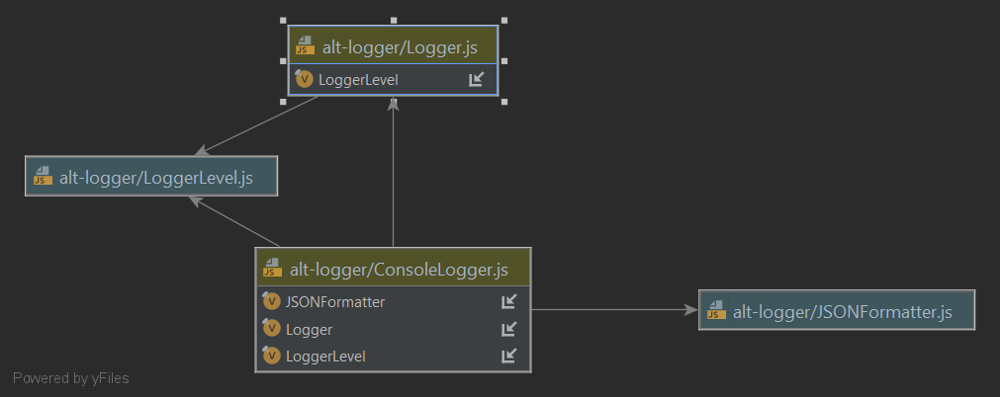

<a name="logging">Logging</a>
=============================

<a name="why">Why Start With Logging?</a>
-------------------------------------------
When writing application code, it’s a useful if our application code is observable.

> __Good Design Rule:__  application code should be observable.

Observability is a very natural thing for code developers, and in fact usually the very first thing we do.

```javascript
// We’ve all done this.
console.log('Hello world!');
```

We use logging to observe the behaviour of our code, quickly and easily, and as a fallback in lieu of more advanced 
tooling that may not be present in an applications deployment context, such as debuggers or profilers. But, 
observability has a natural trade-off &ndash; I/O is expensive.  It is a fundamental obligation tThat application 
logging is performant.

> __Good Design Rule:__  application logging must be performant.

Writing every other line to disk, and spamming output streams with megabytes of data no man or machine could reasonably 
consume is bad. But, _some_ people do it.

<a name="why">JavaScript Logging</a>
------------------------------------

JavaScript offers various options for logging, and the [@alt-javascript/logger](https://www.npmjs.com/package/@alt-javascript/logger) package in the 
[alt-logger](https://github.com/craigparra/alt-logger#readme) repository 
explores these. At it’s most basic design expression, logging can just be achieved with just the 
`console.log` function:

```javascript
// I mean, just don't
console.log('a debug message');
```

It’s helpful when your developing, but it’s prudent to remove console.log statements from production code. 

> __Good Design Rule:__ remove console.log statements from production ready code.

It's such an important rule, that the no-console eslint rule will pleasantly warn you, like a friendly boss.

```shell
C:\usr\src\alt-package-conventions\Colour.js
  4:5  warning  Unexpected console statement  no-console
✖ 1 problem (0 errors, 1 warning)
```

To solve this, it's useful to abstract all our logging statements behind a common façade, or 
wrapping module, which has the benefit of isolating that pesky eslint no-console rule to just one-line of code.

> __Good Design Rule:__ abstract all logging statements behind a common façade.

<a name="consolelogger">A Simple Console Logger</a>
---------------------------------------------------

Now, we're definitely _not in the business of writing loggers_, and there are great packages in the community like 
[winston](https://www.npmjs.com/package/winston) that pretty much abstract logging for us already, but the simple
[Logger](https://github.com/craigparra/alt-logger/blob/master/Logger.js) class is a succinct example of a 
simple logger facade that demonstrates some useful logging utility that might otherwise be overlooked in the weeds of
winston, and also opens up our options, as we will see.

```javascript
const LoggerLevel = require('./LoggerLevel');

module.exports = class Logger {
  constructor(category, level, levels) {
    this.category = category || 'ROOT';
    this.levels = levels || LoggerLevel.ENUMS;
    this.level = this.levels[level || LoggerLevel.INFO];
  }

  setLevel(level) {
    this.level = this.levels[level || LoggerLevel.INFO];
  }

  isLevelEnabled(level) {
    return this.levels[level] <= this.level;
  }

  isFatalEnabled() {
    return this.isLevelEnabled(LoggerLevel.FATAL);
  }

  isErrorEnabled() {
    return this.isLevelEnabled(LoggerLevel.ERROR);
  }

  isWarnEnabled() {
    return this.isLevelEnabled(LoggerLevel.WARN);
  }

  isInfoEnabled() {
    return this.isLevelEnabled(LoggerLevel.INFO);
  }

  isDebugEnabled() {
    return this.isLevelEnabled(LoggerLevel.DEBUG);
  }

  isVerboseEnabled() {
    return this.isLevelEnabled(LoggerLevel.VERBOSE);
  }
};
```

The Logger class accepts a category, a severity level and optionally custom levels.  From a design perspective, this allows 
our application logging to be specific and granular in 2-dimensions &ndash; _severity and context_.

> __Good Design Rule:__ application logging should be granular, with specific _severity and context_.

With the provided level set on the logger, the class can now discriminate whether a statement should be logged based on the 
intended severity for that specific logger instance, with the familiar `info`, `debug` and `error` like functions that
[winston](https://www.npmjs.com/package/winston) and such support.

```javascript
  logger.debug(`Show me this ${value} if level is equal or greather than debug`);
```

The `Logger` doesn't actually implement the `debug` or other functions yet, because it is an ostensibly "abstract" class
with no output transport, combined with the way JavaScript prototype inheritance works.  

What `Logger'` does provide though, is an interface to pre-test if a severity level is "enabled", before performing an 
expensive operation to output.   Because logging is entirely for the developer or operator, and not an application 
feature as such, and it's I/O may have an impact on performance, simply invoking the usual 
`logger.debug('Show me the result of a ${costlyFunction()}')` would be too late in this example statement, because the 
expression is _always_ calculated before the severity is checked.

```javascript
if (logger.isDebugEnabled()){
    logger.debug('Show me the result of a ${costlyFunction()}');
}
```

`Logger'` is extended by the [ConsoleLogger](https://github.com/craigparra/alt-logger/blob/master/ConsoleLogger.js)
class, as shown.




First and for most, `ConsoleLogger`, implements the output transport with `console.log()` exempted from the usual
eslin no-console rule in this case, and adds in the familiar `info`, `debug` and `error` like functions that we 
expect to see.

```javascript
  log(level, message, meta) {
    if (this.levels[level] <= this.level) {
        // eslint-disable-next-line no-console
        console.log(this.formatter.format((new Date()), this.category, level, message, meta));
    }
    
    debug(message, meta) {
        this.log(LoggerLevel.DEBUG, message, meta);
    }
}
```

It also accepts an output formatter and default metadata that will be added to the log lines.  
Take note of how the prototype inheritance works (it explains why `Logger` doesn't implement what would be
redundant functions).

```javascript
  
const Logger = require('./Logger');
const LoggerLevel = require('./LoggerLevel');
const JSONFormatter = require('./JSONFormatter');

module.exports = class ConsoleLogger extends Logger {
  constructor(category, formatter, level, meta, levels) {
    super(category, level, levels);
    this.formatter = formatter || new JSONFormatter();
    this.meta = meta || {};

    ConsoleLogger.prototype.setLevel = Logger.prototype.setLevel;
    ConsoleLogger.prototype.isLevelEnabled = Logger.prototype.isLevelEnabled;
    ConsoleLogger.prototype.isDebugEnabled = Logger.prototype.isDebugEnabled;
    ConsoleLogger.prototype.isVerboseEnabled = Logger.prototype.isVerboseEnabled;
    ConsoleLogger.prototype.isInfoEnabled = Logger.prototype.isInfoEnabled;
    ConsoleLogger.prototype.isWarnEnabled = Logger.prototype.isWarnEnabled;
    ConsoleLogger.prototype.isErrorEnabled = Logger.prototype.isErrorEnabled;
    ConsoleLogger.prototype.isFatalEnabled = Logger.prototype.isFatalEnabled;
  }

  log(level, message, meta) {
    if (this.levels[level] <= this.level) {
      // eslint-disable-next-line no-console
      console.log(this.formatter.format((new Date()), this.category, level, message, meta));
    }
  }

  debug(message, meta) {
    this.log(LoggerLevel.DEBUG, message, meta);
  }

  verbose(message, meta) {
    this.log(LoggerLevel.VERBOSE, message, meta);
  }

  info(message, meta) {
    this.log(LoggerLevel.INFO, message, meta);
  }

  warn(message, meta) {
    this.log(LoggerLevel.WARN, message, meta);
  }

  error(message, meta) {
    this.log(LoggerLevel.ERROR, message, meta);
  }

  fatal(message, meta) {
    this.log(LoggerLevel.FATAL, message, meta);
  }
};
```

At this point, we have a fairly high functioning console logging abstraction with only five classes in play: `Logger`,
`LoggerLevel`,`ConsoleLogger`,`JSONFormatter` and `PlanTextFormatter`.  We can abstract away our logging, and set a 
specific severity level on any individual logger instance as so:

```javascript
const {ConsoleLogger,JSONFormatter} = require('@alt-javascript/logger');
const logger = new ConsoleLogger(`@myscope/mypackage/MyClass`,new JSONFormatter(),LoggerLevel.INFO);
logger.info('Hello world!');
```

And you will get:

```JSON
{"level":"info","message":"Hello World!","timestamp":"2021-07-15T02:09:56.062Z","category":"@myscope/mypackage/MyClass"}
```

It is a good choice to output log lines as JSON in production, as it is easily consumed by log aggregation tools like 
[Logstash](https://www.elastic.co/logstash/), and okay for humans as well.   Plain text should be reserved for local 
developement only.

> __Good Design Rule:__ application log lines should be output formatted as JSON in production.

You will note that the parameters in the line `new ConsoleLogger(`@myscope/mypackage/MyClass`,new JSONFormatter(),LoggerLevel.INFO);` 
are clunky, and that's because the ConsoleLogger doesn't quite meet the second part of our design expectation, that logging
should by specific severity and _context_.  We provide a contextual category, and we write it to the log line, but
it isn't actually used to determine if a log line should be output.  Ideally, we should determine the severity level by
the context category that the logger is defined with, which we do with the `ConfigurableLogger`.